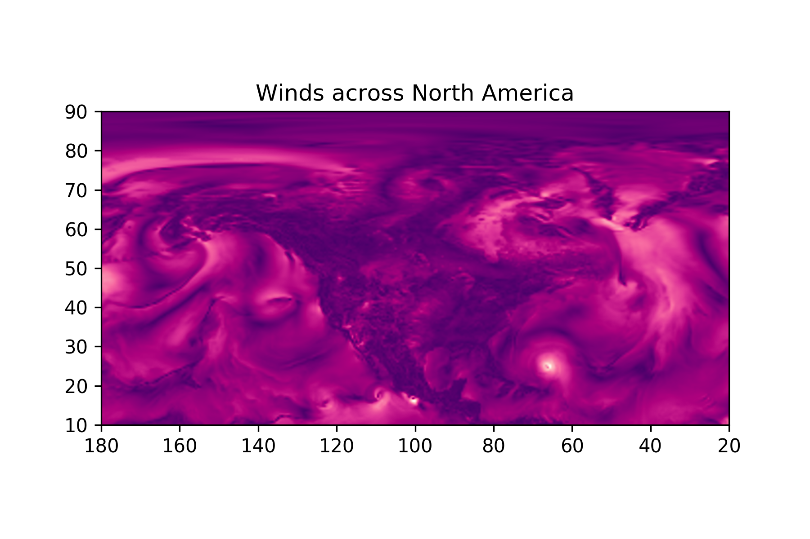

# A site for providing weather information suitable to sailors
... or at least experimenting with the idea. This is very much under development. As of now nothing is very functional.

<p align="center">

</p>

## getting weather data from GRIB files
NOAA releases GRIB files with weather global weather forecasts from the GFS model, but collecting these directly from the NOAA haven't worked for me yet. Instead i collect them via [saildocs](saildocs.com), which serves certain variables of GFS forecasts via email. `GET_A_GRIB.py` contains code to query for a GRIB file at saildocs. In the future it will hopefully also contain methods for getting the files from NOAA.

### Getting GRIB by email
To use this you need a gmail account with a folder named >saildocs<, and manually tell Gmail to store mail from saildocs here. You also need a .py file named `keys.py` with the following content:

```python
user = "YOUR_EMAIL_ADDRESS@gmail.com"
pwd = "YOUR_GOOGLE_APP_PASSWORD"
```
If you dont use 2-factor authentication on your google account you should consider activating it, or you might need to modify this a bit.

the function `saildocs_query()` produces valid queries for saildocs, and required the lat-lon bounding box as parameters, as well as a range of optional parameters for forecast variables and forecast times.

`send_query()` interacts with your gmail account to send requests to saildocs, while `get_attachment` downloads the latest received email (this is possibly dependent on your gmail account sorting mails by date) and stores the attached GRIB file in the directory you supply. Furthermore it returns the path to the downloaded file, so you dont have to manually type it in.


### Unpacking GRIB files
Unpacking of the GRIB files is done with the classes stored in `READ_A_GRIB.py`. Simply call `READ_A_GRIB.GRIB(path/to/file/filename.grb)` to get started. For more info see the source of `READ_A_GRIB`

## Getting weather data from various API's.

The file `weather.py` contains three classes, two of which are designed to access API's. The last class is simply a couple of functions used to pack api responses as csv files.

`class fromOpenAPI()` Contains functions to interact with the openweatherdata API. To see which requests are supported, look at the code. It should be fairly straight forward what is required. Like the GRIB files this relies on you creating a `keys.py` file, with the relevant authorization codes for the API.

`class fromDarkskyAPI()` is similar to the above, but uses the DarkSky API. Note that darksky charges money for using their API for more than 1000 requests per day.

## Plotting
`plots.py` contains definitions for a number of plots, while `runplots.py` gathers all the required data from API's and GRIB files and then runs the plots from `plots.py` use these as you like. `map.html` contains the leaflet map with wind animations and requires GRIB data to work.

the `.R` files contain various attempts at plotting maps as well. Not all are used on the webpage.


### Interactive Map
The map is heavily reliant on [danwild/leaflet-velocity](https://github.com/danwild/leaflet-velocity?files=1) and in turn all the work he credits.
