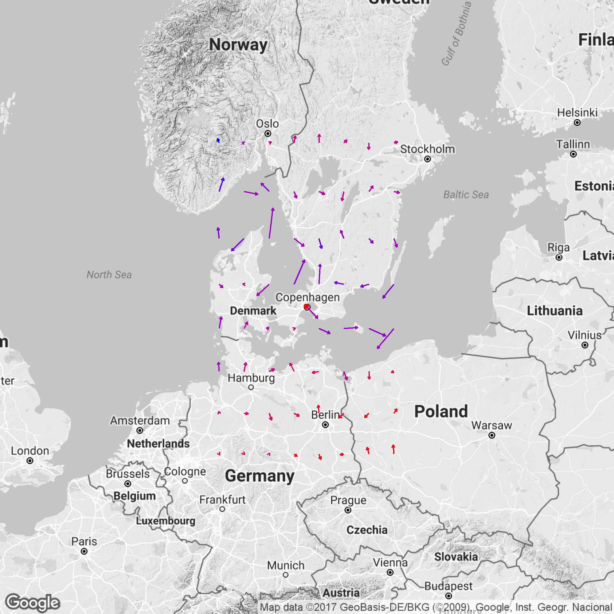

<html lang="en">
  <head>
    <meta charset="utf-8">
    <meta name="viewport" content="width=device-width, initial-scale=1, shrink-to-fit=no">
    <meta name="description" content="">
    <meta name="author" content="">
    <link rel="icon" href="../../../../favicon.ico">

    <title>Weather data content</title>

    <!-- Bootstrap core CSS -->
    <link href="assets/css/bootstrap.min.css" rel="stylesheet">
    <link href="assets/css/bootstrap-theme.css" rel="stylesheet">

    <!-- Custom styles for this template -->
    <link href="assets/css/grid.css" rel="stylesheet">
  </head>

  <body>
    

    <nav class="navbar navbar-toggleable-md navbar-light bg-faded">
      <button class="navbar-toggler navbar-toggler-right" type="button" data-toggle="collapse" data-target="#navbarNavAltMarkup" aria-controls="navbarNavAltMarkup" aria-expanded="false" aria-label="Toggle navigation">
        
      </button>
      <a class="navbar-brand" href="#">Navbar</a>
      

        

          <a class="nav-item nav-link active" href="#">Home (current)</a>
          <a class="nav-item nav-link" href="#">Features</a>
          <a class="nav-item nav-link" href="#">Pricing</a>
          <a class="nav-item nav-link disabled" href="#">Disabled</a>
        

      

    </nav>

  

      <h3>Two columns</h3>

      

        

        

        
        

        

        
This chart shows the development of wind for the following 48 hours after last update, starting from the dot.

      

      <h3> Two more columns </h3>

      

        

        Current wind directions around vessel, color represent temperatures with red being hot and blue cold. Note wind direction data are not very reliable and shouldn't be considered final.
        

        

        
        

        <h3>Two columns</h3>  
        

          

          
          

          
 Lorem Ipsum

        

      

    
 <!-- /container -->

    <!-- Bootstrap core JavaScript
    ================================================== -->
    <!-- Placed at the end of the document so the pages load faster -->
    <!-- IE10 viewport hack for Surface/desktop Windows 8 bug -->
    
  </body>
</html>
