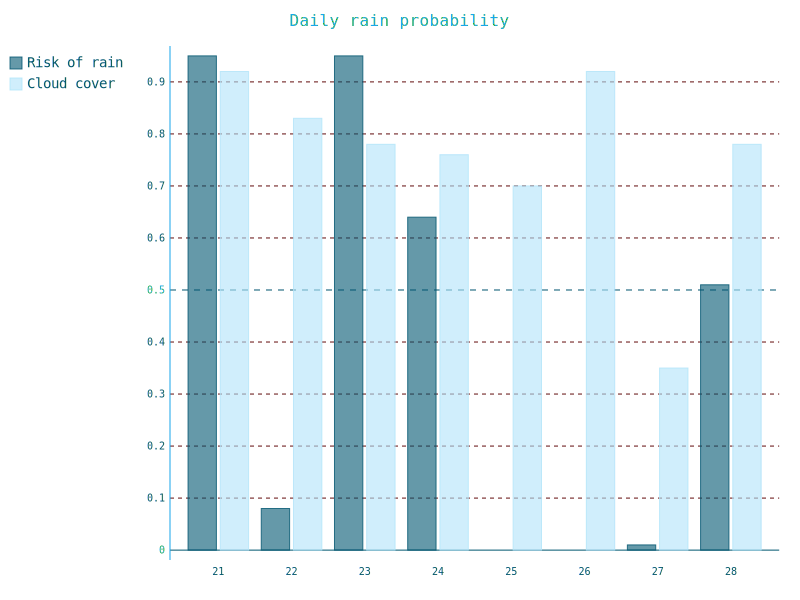
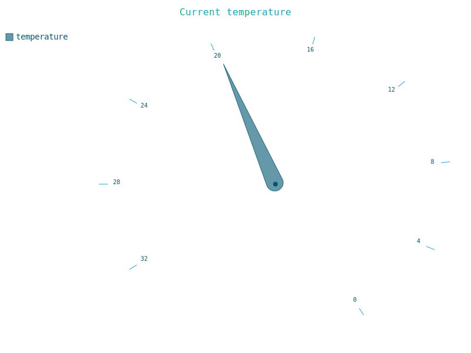
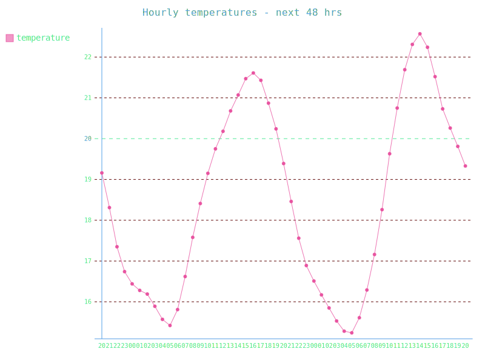
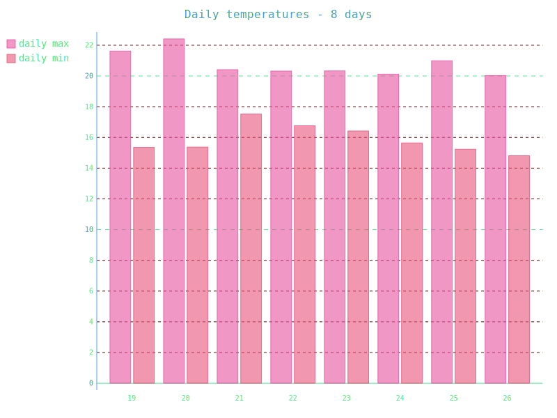
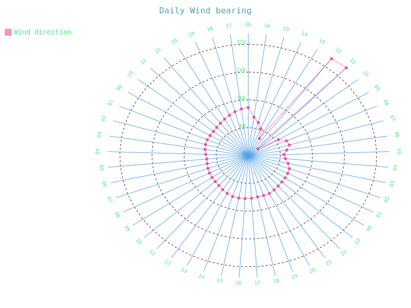
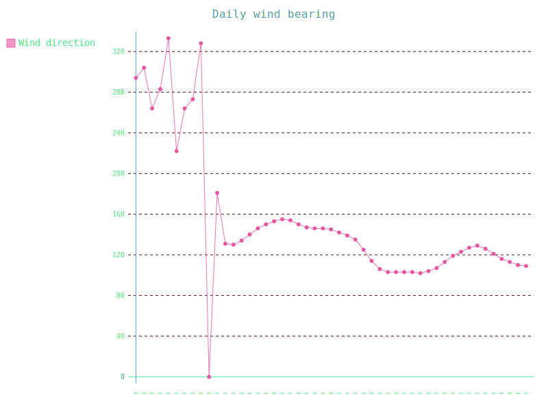
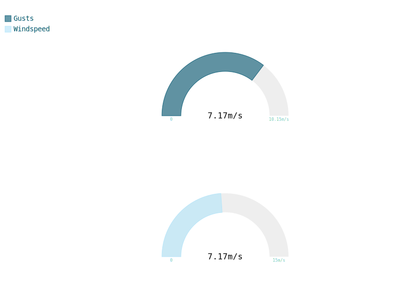

## Risk of rain

    
   8-day forecast for the risk of rain or other precipation and the cloud cover fraction 

## Current temperature

   Gauges the current temperature 
  

# Temperature for the next 48 hours

    
   Temperatures for the comming 48 hours 

## ... and for the next 8 days

   and over the nex 8 days 
  

# Wind bearing

    
   Wind-bearing for the comming 48 hours 

    
   Radar format 

## windspeed and windgusts

   Shows the average wind speed alone and as a fraction of the highest recorded gusts 
  

## Some plotly testing

'

'
